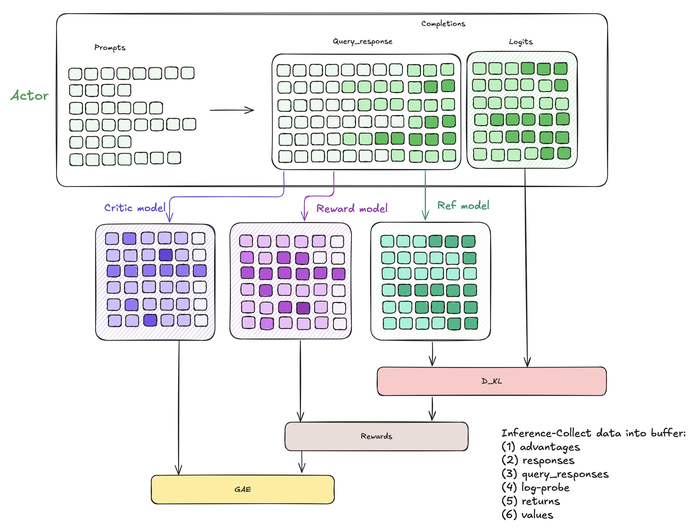
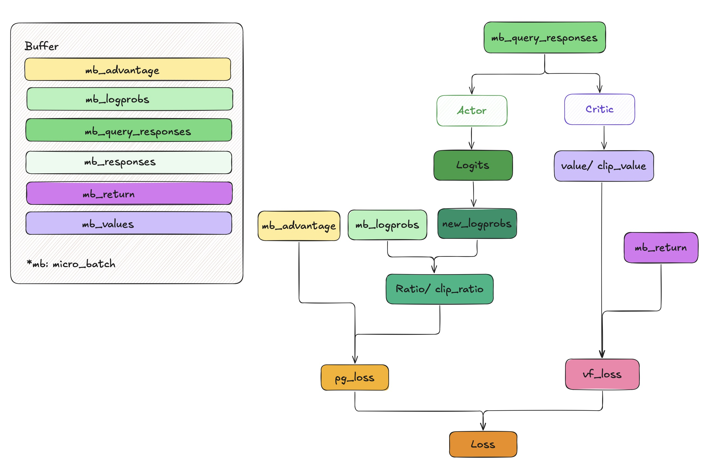

## Introduction

The **Proximal Policy Optimization (PPO)** algorithm, proposed by OpenAI in 2017 [[1]](#references), establishes a robust policy gradient framework that combines three core components: clipped objective functions, value estimation, and entropy regularization.

---

### Objective Function
The unified optimization objective integrates three key elements:  
    
$$L_t^{\text{CLIP+VF+S}}(\theta) = \mathbb{E}_t \left[ L_t^{\text{CLIP}}(\theta) - c_1 L_t^{\text{VF}}(\theta) + c_2 S[\pi_\theta](s_t) \right]$$

#### 1. Clipped Surrogate Objective  
  
$$L_t^{\text{CLIP}}(\theta) = \mathbb{E}_t \left[ \min\left( r_t(\theta) \hat{A}_t,\ \text{clip}\left( r_t(\theta),\ 1-\epsilon,\ 1+\epsilon \right) \hat{A}_t \right) \right]$$  
  
where $r_t(\theta) = \frac{\pi_{\theta}(a_t \mid s_t)}{\pi_{\text{old}}(a_t \mid s_t)}$ is ratio paremeter, $\hat{A}_t$ is advantage estimate and $\epsilon \in [0.1, 0.3]$ a clipping threshold which contrains policy update in a safe limit.
  

#### 2. Value Function Loss  
  
$$L_t^{\text{VF}}(\theta) = \frac{1}{2} \mathbb{E}_t \left[ \left( V_\theta(s_t) - V_t^{\text{targ}} \right)^2 \right]$$  
  
*Implementation Note*: The $\frac{1}{2}$ coefficient serves as a gradient scaling factor.  
  

#### 3. Entropy Regularization  
  
$$S[\pi_\theta](s_t) = -\sum_{a'} \pi_\theta(a'|s_t) \log \pi_\theta(a'|s_t)$$  
  
**Tips**:  
  Coefficients $c_1$ and $c_2$ balance the policy update, value function accuracy, and entropy bonus. Usually value loss weight is set to $c_1 \in [0.5, 1.0]$ and entropy bonus weight is $c_2 \in [0.01, 0.05]$.

---

### Architecture & Execution Pipeline  
  
#### Network Architecture Components
The policy network $\pi_\theta(a|s_t)$ and value function estimator $V_\theta(s_t)$ share a unified neural architecture with sepecialized components such as feature encoder
$h_t=f_\theta^{encoder}(s_t)$ with separate heads, e.g. policy head with $\pi_\theta(a|s_t)={\rm softmax}(W_\pi h_t+b_\pi)$ and output probability distribution over action $\mathcal{A}$ while value head maybe $V_\theta(s_t)=W_vh_t+b_v$ with a scalar value estimate.
  
---

### Execution Workflow

#### Phase 1: Experience Collection Pipeline  
During the rollout phase, agents interact with the environment using the old policy $\pi_{\text{old}}$ to generate trajectories $$\tau=\{(s_t, a_t, r_t)\}_{t=0}^{T-1}$$. Subsequently, the Generalized Advantage Estimation (GAE) method computes advantage values $\hat{A}_t$ through recursive temporal difference calculations:

$$
\begin{aligned}
\delta_t &= r_t + \gamma V_\theta(s_{t+1}) - V_\theta(s_t), \\
\hat{A}_t &= \sum_{\ell=0}^{T-t-1} (\gamma\lambda)^\ell \delta_{t+\ell},
\end{aligned}
$$

where $\gamma$ is the discount factor and $\lambda$ the GAE smoothing coefficient. Processed transitions $$(s_t, a_t, \hat{A}_t, V_t^{\mathrm{targ}})$$ — with target values $$V_t^{\mathrm{targ}}=\hat{A}_t+V_\theta(s_t)$$ — are stored in an experience replay buffer (capacity: $10^5 \sim 10^6$). This staged pipeline decouples data collection from policy updates while maintaining sample diversity through large-scale experience reuse.


#### Phase 2: Parameter Update
For $K$ optimization epochs:
1. *Mini-batch Sampling*: Uniformly sample $B$ transitions ($B \in [64, 2048]$) from buffer.

2. *Policy Optimization*: Compute gradients for the clipped surrogate objective:
$$\nabla_\theta L^{CLIP}=\mathbb{E}_t\left[\min\left(r_t(\theta)\hat{A}_t, {\text clip}(r_t(\theta), 1-\epsilon, 1+\epsilon)\hat{A}_t\right)\nabla_\theta\log\pi_\theta(a_t|s_t)\right]$$

3. *Value Network Update*: Minimize the value function's MSE loss through SGD:
$$\nabla_\theta L^{VF}=\mathbb{E}_{(s_t, V_t^{\text targ})\sim {\text buffer}}\left[(V_\theta(s_t)-V_t^{\text targ}\nabla_\theta V_\theta(s_t))\right]$$

4. *Entropy Adaptation* (Optional): Dynamically adjust $c_2$ based on entropy monitoring.

---  
  
## Applications 

This part will show some applications with PPO including Reinforcement Learning from
Human Feedback (RLHF)[[2]](#references) as well as Atari games.  
  
---  

### Reinforcement Learning from Human Feedback (RLHF)  
RLHF is introduced to further align an LLM to human values. In this part, I attempt to show the details of implementation of RLHF with PPO, including:  
  
- The data workflow of RLHF  
- The mainstream framework 
- Examples  
  
#### The data workflow of RLHF  
  
PPO-based RLHF system typically consists of 4 LLMs: an actor, a critic, a reference policy network and a reward model. PPO-based RLHF proceeds in iterations, each with 3 stages:  
  
- response generation using the actor model with a batch of prompts
- preparation of training data by scoring the generated response through a single forward pass of the critic, reference policy and rewards models
- learning from human preference by updating actor and critic through and backward computation.
  
  
  
After inference, we have collected some data which will be stored into buffer:  
- logprob (from actor)
- ref_logprob (from reference model)
- rewards (token-level rewards, consists of **kl** (*logprobs - ref_logprobs*) and **scores** generated by reward model) 
- values (from critic) 
- token-level advantages  
  
During training, we sample data from buffer and update actor and critic by PPO methods.  
  
  
  
#### The mainstream framwork  
  
**1. TRL**  

From my perspective, TRL [[3]](#references) is a comprehensive and user-friendly library to post-train foundation models. There exists many advanced techniques like Supervised Fine-Tuning (SFT), Proximal Policy Optimization (PPO) and Group Relative Policy Optimization (GRPO) and so on.  

For initial implementation, I strongly recommend reading the [Official PPO Trainer Documentation](https://huggingface.co/docs/trl/main/en/ppo_trainer).  
  
Here, I aim to highlight the core computation codes, which will help you gain a deeper understanding of PPO in the RLHF (Reinforcement Learning from Human Feedback) scenario. For comprehensive implementation details, refer to the canonical guide:  The N Implementation Details of RLHF with PPO [[4]](#references).  
    
1. How to get scores?  
   We feed query as well as response into reward model to attain scores. This means that each score of a token is highly depends on priori tokens.  
2. How to compute rewards?  
   Through reward model, we attain scores which is only given at the end of episode with shape (bs, 1). But it is not the final reward. Actually, The complete reward function combines supervised signal and policy constraint ([trl/trl/trainer
/ppo_trainer.py#509](https://github.com/huggingface/trl/blob/64aa06499b2e71537a8e701fad076873b0f3603f/trl/trainer/ppo_trainer.py#L509-L515)):  
     
    $$ \mathcal{R}(x,y) = \underbrace{r_\theta(x,y)}_{\text{Reward Model}} - \beta \cdot \underbrace{D_{\text{KL}}\big(\pi_\phi(y|x) \parallel \pi_{\text{ref}}(y|x)\big)}_{\text{Policy Regularization}} $$
   
  
   - During the first PPO update epoch and minibatch update, the activate policy have the same log probabilities `new_logprobs=[-3.3213, -4.9980, -3.8690]`, so the per-token KL penalty would be `kl = new_logprobs - logprobs = [0., 0., 0.,]`.
   - However, after the first gradient backward pass, we could have `new_logprob=[-3.6528, -5.0406, -3.2339]`, so the per-token KL penalty becomes `kl = new_logprobs - logprobs = [-0.3315, -0.0426, 0.6351]`.
   - Then the `non_score_reward = beta * kl` where beta is the KL penalty coefficient $\beta$, and it's added to the score obtained from the reward model to create the rewards used for training. The score is only given at the end of episode; it could look like `[0.4,]`, and we have `rewards = [beta * -0.3315, beta * -0.0426, beta * 0.6351 + 0.4]`.

3. Scale the logits by sampling temperature  
   When calculating the log probability of responses, the model first outputs the logits of the tokens in reponses, followed by dividing the logits with the sampling temperature ([lm_human_preferences/policy.py#L121](https://github.com/openai/lm-human-preferences/blob/cbfd210bb8b08f6bc5c26878c10984b90f516c66/lm_human_preferences/policy.py#L121)) i.e.,  
   ```python
   logits /= self.temperature
   ```
   It is said that without this scaling, the KL would rise faster than expected, and performanc would deteriorate[[4]](#references).  

4. [Pytorch Adam optimizer numerical issues w.r.t RLHF](https://huggingface.co/blog/the_n_implementation_details_of_rlhf_with_ppo#pytorch-adam-optimizer-numerical-issues-wrt-rlhf).


## References
1. Schulman, J., Wolski, F., Dhariwal, P., Radford, A., & Klimov, O. (2017). Proximal Policy Optimization Algorithms. *arXiv preprint arXiv:1707.06347*.  
   DOI: [10.48550/arXiv.1707.06347](https://doi.org/10.48550/arXiv.1707.06347)  
2. Yuntao Bai, Andy Jones, Kamal Ndousse, Amanda Askell, Anna Chen, Nova DasSarma, Dawn Drain, Stanislav Fort, Deep Ganguli, Tom Henighan, et al. 2022. Training a helpful and harmless assistant with reinforcement learning from human feedback. arXiv preprint *arXiv:2204.05862 (2022)*.
3. [https://github.com/huggingface/trl](https://github.com/huggingface/trl)
4. [The N Implementation Details of RLHF with PPO](https://huggingface.co/blog/the_n_implementation_details_of_rlhf_with_ppo)
5. Diederik K. Adam: A method for stochastic optimization[J]. (No Title), 2014.